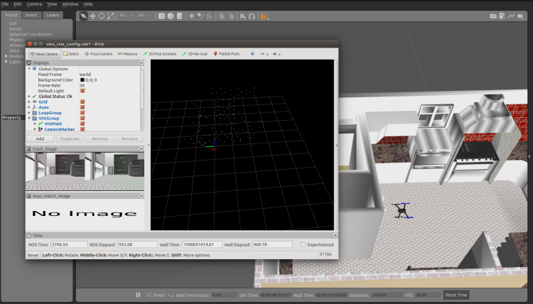
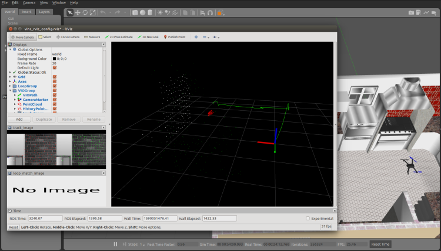

# VISION-IMU CONTROL SYSTEM FOR DRONES
## An optimization-based multi-sensor state estimator
It is an optimization-based multi-sensor state estimator, which achieves accurate self-localization for autonomous applications (drones, UAVs). It is an extension of SLAM, which supports multiple visual-inertial sensor types (mono camera + IMU, stereo cameras + IMU, even stereo cameras only).
**Features:**
- multiple sensors support (stereo cameras / mono camera+IMU / stereo cameras+IMU)
- online spatial calibration (transformation between camera and IMU)
- online temporal calibration (time offset between camera and IMU)
- visual loop closure

## 1. Prerequisites
### 1.1 **Ubuntu** and **ROS**
Ubuntu 64-bit 16.04 or 18.04.
ROS Kinetic or Melodic. [ROS Installation](http://wiki.ros.org/ROS/Installation)


## 2. Build Source Code
Clone the repository and catkin_make:

```
	cp -r ~/Vision-IMU-control-system-for-Drones/Vision ~/catkin_ws/src/
	cp ~/Vision-IMU-control-system-for-Drones/run.sh ~/catkin_ws/scripts
	cd ~/catkin_ws
	catkin build
	source ~/catkin_ws/devel/setup.bash
```


## 3. Simulation

Start the simulation program, note that iris_stereo_camera.sdf is used in the launch file.

```
	cp init.d-posix/rcS ~/PX4Autopilot/ROMFS/px4fmu_common/init.d-posix/
	cp worlds/* ~/PX4-Autopilot/Tools/sitl_gazebo/worlds/
	cp -r models/* ~/PX4-Autopilot/Tools/sitl_gazebo/models/ 
	cp -r launch/* ~/PX4-Autopilot/launch/
	cd ~/PX4-Autopilot
	make px4_sitl_default gazebo
	roslaunch px4 indoor1.launch
```

Then Visual Inertial Odometry starts




Since this package publishes an Odometry type topic, we need to convert it to the topic required by PX4.

```
	cd ~/Vision-IMU-control-system-for-Drones/
	python3 vio_tx.py iris

```

At this time, the output of the PX4 emulation terminal appears as shown below, which represents the successful fusion of visual information.

```
	INFO  [ecl/EKF] 1213644000: reset position to ev position
	INFO  [ecl/EKF] 1213644000: commencing external vision position fusion
	INFO  [ecl/EKF] 1213644000: commencing external vision yaw fusion
```

Then establish communication, and take off with keyboard control.

```
	cd ~/Vision-IMU-control-system-for-Drones/
	python3 communicate.py iris 0
	
```



